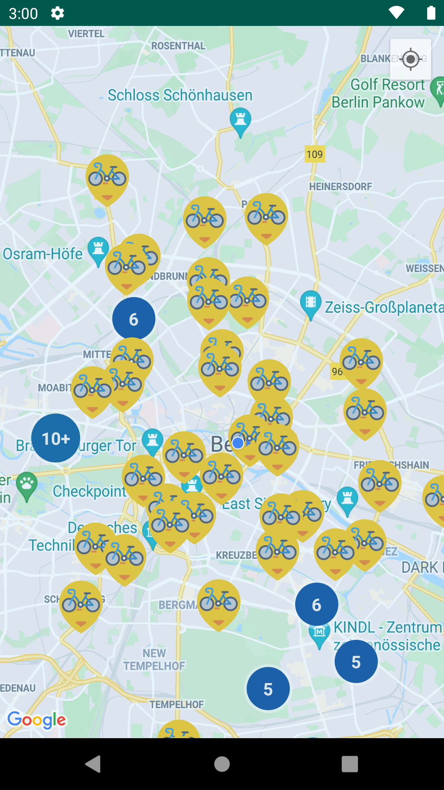

Welcome to the Tier sample app!



This is a sample Android project showcasing how I usually work.

The app will ask for location permission, and show your location on the map while loading vehicles
in the background from an API considering error cases and displaying them as markers and clusters.
If you click on a marker it'll display a bottom sheet showing some details of the vehicle.

# Project structure

## Modules, modules everywhere

Modularization has lots of advantages (building speed, code-mess bulletproof, re-usability, etc..)
and I'm following this pattern, sorted by the most to the less visibility:

*app* module: Contains the dependency injection and global modules, navigation across modules and
the MainApplication.

*coordinator-XXX* module: It follows these conditions:

- This type of module contains feature modules inside of it or references to different feature
  modules (if they're shared across the project).
- It's an Activity routing several Fragments and managing a shared scope.

*feature-YYY* module:

- A feature module which contains a feature. Usually a single screen.
- It contains dependencies to core modules and might contain to a parent feature module.

*shared-XXX* module:

- A shared module which contains specific classes shared across different feature modules.
- Common business classes or widgets used across different features are here.

*core-XXX* module:

- A module which contains project's agnostic code. It could be used in any other project.
- It might contain dependencies to other core modules.

## Architecture

I'm using a homemade and opinionated framework, used in several production applications, based on a
MVI pattern.

The aim of this framework is to:

- Increase testability
- Hide framework details (Android) so you could use it in multiplatform projects
- Manage Android framework flaws (memory management, rotation, etc...) in a simple an intuitive way
- Increase development speed
- Create cohesion among developers

For more information please check, and star ;), the Terminator library in Github (https://github.com/marcohc/terminator)

## CI/CD

There are a set of git hooks which run once you commit and push code running static analysis and
tests. For more info check the installation guide below.

These commands run usually on Jenkins using Fastlane. But I've done it as well with Gitlab CI/CD.
I have not included any of these configuration files because these often include specifics about the server and infrastructure
built on.

But these are the common steps I set up (but not only):

### Build

```
./gradlew assembleNormalDebug
```

### Static analysis

The project runs detekt, a static analysis tool [https://github.com/detekt/detekt]
The plugin is in "config/detekt.gradle" and the config file in "config/detekt-config.yml"

```
./gradlew detekt
```

### Unit tests

```
./gradlew testDebugUnitTest
```

### Build (for integration branches) or run (for develop and releases) Instrumentation tests

To build:

```
./gradlew assembleMockDebugAndroidTest
```

To build and run:

```
./gradlew connectedMockDebugAndroidTest
```

### Release

To build --> Gradle + Fastlane plugin:

```
./gradlew assembleNormalRelease
```

To release to Play Store --> Fastlane plugin

## Version control

I use the standard Gitflow methodology (https://www.atlassian.com/git/tutorials/comparing-workflows/gitflow-workflow).

# Before you run the app or start coding

## Set up API keys

In order to run the app you must add the necessary keys for the vehicle data and maps API in the
file "local.properties" in the root of the project:

- API_KEY="your_super_secret_api_key_here" (Mind the quotes, they're needed there)
- MAPS_API_KEY=your_maps_api_here (More info here https://developers.google.com/maps/documentation/android-sdk/start)

Please DO NOT commit the "local.properties" file to any version control.

## Set up code style

It follows the Kotlin code style (https://kotlinlang.org/docs/coding-conventions.html).

#### Installation

##### Automatic installation for Android Studio/IntelliJIdea

* On a the terminal run the following two commands:
    ```sh
    chmod +x install.sh
    ./install.sh
    ```
* Restart Android Studio or IntelliJIdea if it's running.
* Open Project Settings -> Editor -> Code Styles, change the code style for the project to "
  MarcoCodeStyle".

##### Manual Installation

* Open Project Settings -> Editor -> Code Styles -> Manage -> Import -> choose file
  from `config/code-style/code-style.xml`, change the code style for the project to "MarcoCodeStyle"
  scheme.
* Restart Android Studio or IntelliJIdea if it's running.

## Git hooks

### Installation

* Go to 'config/hooks'
* Run the script "install.sh"

### Usage

#### Pre-commit hook

This hook can be run on the Terminal or Android Studio VCS Wizards.

An static analysis will run every time you create a commit, it might fail due to an incorrect code
change, so please fix it if so.

#### Pre-commit hook

This hook can be only run on the Terminal.

It'll ask you which option to use, but please use the third one unless is not code related changes
i.e changing the README.md file.

# Thanks for your time

If you have any questions, or need the API keys, please do no hesitate to contact me ;)
